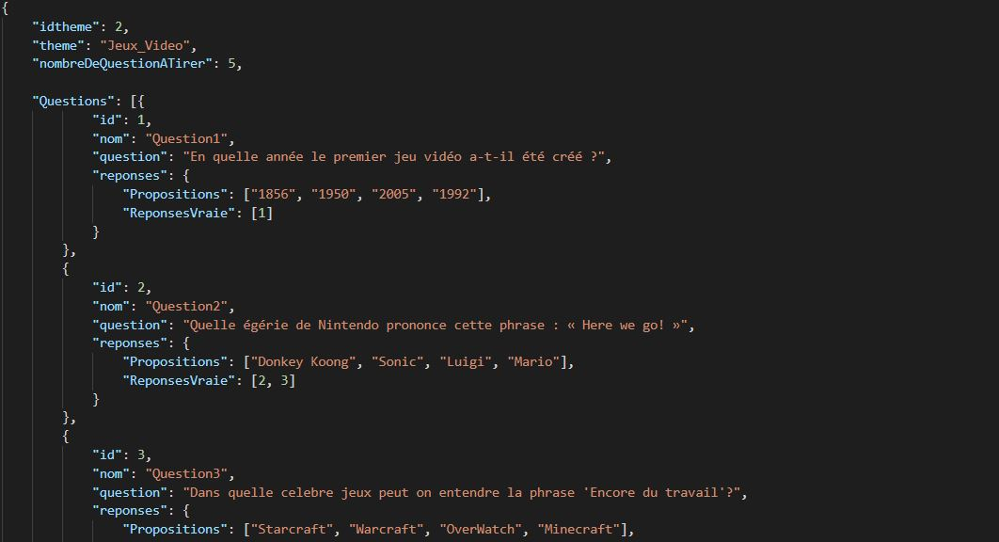
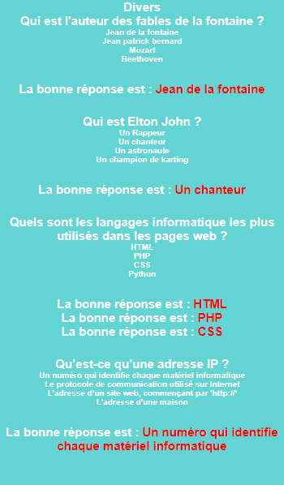
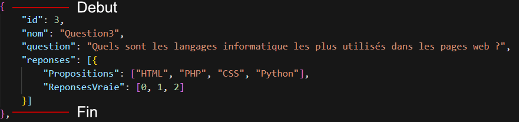
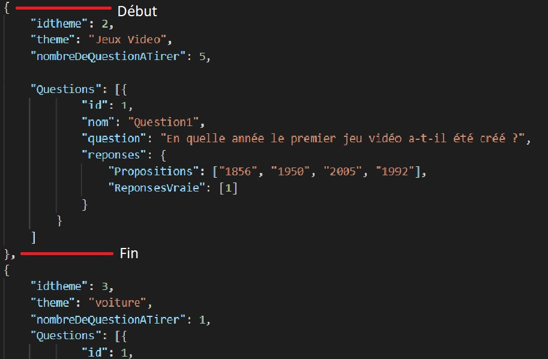

Doussain Jimmy BTS SIO
Dolivet Pierre

# **Bien démarrer**

Le quiz est personnalisable. Il peut contenir plusieurs questions avec un certain nombre de réponse. Il est aussi capable de gérer différent thème. Cette documentation vous permettra de pouvoir ajouter des questions et les personnaliser de même pour les thèmes.

# **Sommaire**

- Fonctionnement du quiz
- Ajout de questions
- Ajout de nouveau thème
- Type de problème

# **Fonctionnement du quiz**

Pour fonctionner ce quiz utilise ce que l&#39;on appelle un fichier Json. Ce fichier n&#39;est pas très permissif. C&#39;est vrai il vous permettra de modifier n&#39;importe quelle question mais il faudra respecter parfaitement la syntaxe ne vous inquiétez pas tout est expliqué.

Voici une partie du fichier json : 

Voici le **premier theme** Divers comme on peut le voir **ligne 4** , rien ne vous empeche de renommer le nom du theme en **changeant tout simplement le text**.

Ici nous nous interresserons seulement de la **ligne 6** a la **ligne 11**. En effet dans ses lignes on y retrouve, la première question du theme : « Qui est l&#39;auteur des fables de la fontaine ? » . La **ligne 6** nous informe du **numero de la question « id » 1** donc premiere question la ligne nom fais de meme.

Ensuite nous pouvons regarder la **ligne 10** ce sont les **réponses possibles** qui seront montrer a l&#39;utiliseur, cet ici que vous pourrez les changers.

La derniere ligne donc **11** definie la bonne réponse ici **la bonne réponse est 0** soit Jean de la Fontaine.

Pourquoi **0** et pas **1** car chaque **nombre est décaler de moins** un je ne rentrerais pas dans les détails mais c&#39;est le fonctionnement. Si pour exemples nous voulions choisir la derniere question en bonne réponses nous choississerions 3 donc la 4 eme réponses

Pour pouvoir avoir **plusieurs réponses** possibles il suffit de l&#39;écrire comme ceci :

# **Partie**

#

# **Créateur**

La partie créateur est un emplacement que vous retrouverez au début du quiz il vous permet de visualiser toutes vos questions et réponses et vous permettras de vérifier que tous concorde bien.

Voci un exemple :

# **Ajout de Question**

Cela se complique un peut comme je le disais le Json n&#39;est pas très permissif donc respecter bien la syntaxe.

Chaque question débute avec un {et finie avec un } tous ce qui se trouve dedans sera utilisé pour la question. Donc pour rajouter une question il ne vous reste plus que à copier-coller en dessous de }. Il n&#39;y a **pas de limite de questions.**

**N&#39;oublier pas de changer**  **l&#39;id**  **de chaque question dans l&#39;ordre**

**Important !** faites attentions chaque question finie par un **« , » (virgule)** sauf la dernière. La dernière ne doit surtout **pas avoir de virgule**.

# **Ajout de Thème**

L&#39;ajout de thème ressemble très fortement à l&#39;ajout de question cependant il faudra prendre le « **{** »se trouvant juste après le « **[** ». Voici un exemple plus compréhensible : 

Il y a deux theme dans cet image le theme Divers et Jeux Vidéo il vous suffit de copier coller un theme dessous un autre mais comme pour les questions n&#39;oublier pas d&#39;augmenter idtheme.

Il faut bien différentier **idtheme** et **id**. **idtheme** est l&#39;id du theme alors que **id** est l&#39;id des questions donc il peut y avoir deux id 1 sans probleme tant que elle ne se trouve pas dans le meme theme.
**Important !** faites attentions chaque thème fini par un **« , » (virgule)** sauf le dernier. Le dernier ne doit surtout **pas avoir de virgule**.
Il faut noter aussi que le thème ne peut pas avoir d’espace (mauvais exemple : Culture G // Bon exemple : Culture_G)

# **Type de Problème**
